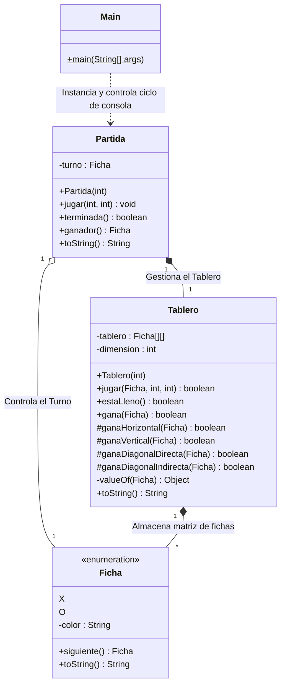

# Tres en Raya (Tic-Tac-Toe) en Java

Este es el clásico juego del **Tres en Raya** implementado en **Java**, pensado para jugarse íntegramente desde la terminal. El juego cuenta con soporte para colores (códigos ANSI), lo que permite visualizar los turnos, los movimientos de cada jugador y los mensajes de error de forma mucho más amigable e intuitiva.

## Estructura del Proyecto

El código está diseñado utilizando Programación Orientada a Objetos, repartiendo muy bien las responsabilidades:



## Cómo jugar

Para jugar a este juego solo necesitas tener instalado el JDK de Java en tu sistema. Sigue estos pasos desde tu terminal (Símbolo del Sistema, PowerShell, etc):

1. **Abre tu terminal** y navega hasta la carpeta `src` de este proyecto (sustituye por la ruta correcta donde hayas clonado el repositorio):
   ```bash
   cd C:\Ruta\Hacia\Tu\Proyecto\Tres-en-raya\src
   ```

2. **Compila todos los archivos fuente Java** con este comando:
   ```bash
   javac *.java
   ```

3. **Ejecuta la clase principal** para arrancar el juego:
   ```bash
   java Main
   ```

Una vez ejecutado, el propio juego irá guiándote por pantalla, pidiéndote los números de **fila** y **columna** (del `1` al `3`) para colocar de manera alterna las fichas `X` y `O`. ¡Diviértete!